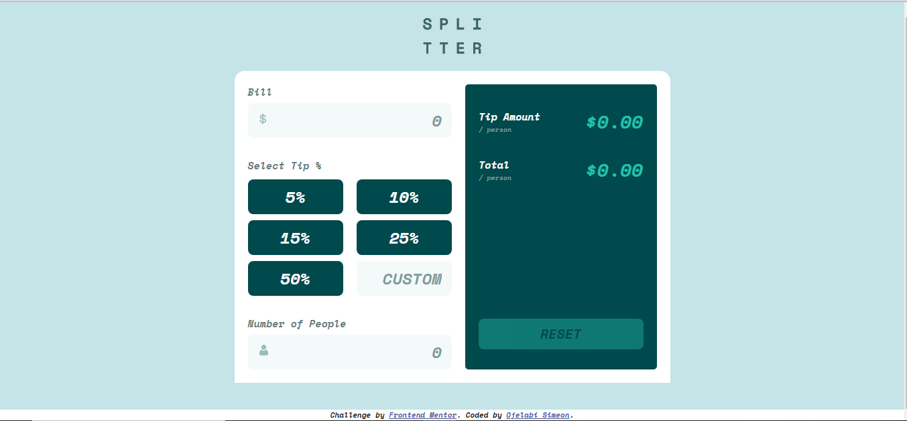

# Frontend Mentor - Tip calculator app solution

This is a solution to the [Tip calculator app challenge on Frontend Mentor](https://www.frontendmentor.io/challenges/tip-calculator-app-ugJNGbJUX). Frontend Mentor challenges help you improve your coding skills by building realistic projects.

## Table of contents

- [Overview](#overview)
  - [The challenge](#the-challenge)
  - [Screenshot](#screenshot)
  - [Links](#links)
- [My process](#my-process)
  - [Built with](#built-with)
  - [What I learned](#what-i-learned)
  - [Continued development](#continued-development)
  - [Useful resources](#useful-resources)
- [Author](#author)

## Overview

### The challenge

Users should be able to:

- View the optimal layout for the app depending on their device's screen size
- See hover states for all interactive elements on the page
- Calculate the correct tip and total cost of the bill per person

### Screenshot




### Links

- Solution URL: [GitHub repo](https://github.com/NobleSimeon/Tip-Calculator-App)
- Live Site URL: [live site](https://tip_calculator.netlify.app)

## My process

### Built with

- Semantic HTML5 markup
- CSS custom properties
- Flexbox
- CSS Grid
- Mobile-first workflow
- Accessible Rich Internet Applications (ARIA)


### What I learned

I learnt of oninput event listener.

```html

```
```css

```
```js


```

### Continued development

I will focus more on Accessible Rich Internet Applications (ARIA) because as a frontend developer I aspire to become must be able to build a site every users can interact with.

Also, the use of addeventlistener


### Useful resources

- [Chat GPT](https://chat.openai.com) - Helped in debugging my code. 


## Author

- Website - [Ojelabi Simeon](https://github.com/NobleSimeon)
- Frontend Mentor - [@NobleSimeon](https://www.frontendmentor.io/profile/NobleSimeon)
- Twitter - [@SimeonPelumi](https://www.twitter.com/SimeonPelumi)


